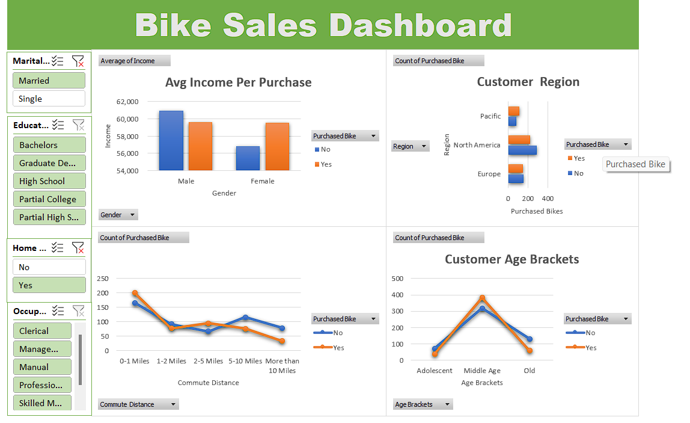

# Excel Data Analysis Project 

## Project Overview  
This project demonstrates data cleaning, the creation of pivot tables, interactive dashboards, and slicers using Excel. It provides dynamic insights and visualizations for effective data analysis.  

## Key Features  
- **Data Cleaning**: Processed raw data for consistency and accuracy.  
- **Pivot Tables**: Generated summaries and insights from the cleaned data.  
- **Interactive Dashboards**: Visualized key metrics with charts and slicers for easy exploration.  
- **Slicers**: Added interactivity for dynamic filtering and analysis.  

## Dashboard Preview  
  

## How to Use  
1. Clone this repository:  
   ```bash  
   git clone https://github.com/monskrish/Pivot-Dashboard-Analysis.git  
   ```  
2. Open the Excel file to explore the dataset and dashboard.  
3. Use the slicers for dynamic filtering and customized analysis.  

## Dataset  
The dataset used for this project is included in the repository:  
- **Raw Dataset**: `Excel Project Raw Dataset.xlsx`  
- **Cleaned Dataset**: `Excel Project Dataset.xlsx`  

## Tools Used  
- **Microsoft Excel**  

